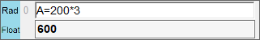
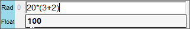
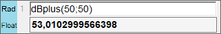

# SimpleCalculator 
A simple calculator GUI using the Artem Los math expression parser with added dB (sound) functions 

  
  
  

There are the following sound functions: 
dbPlus(x1; x2) 
dBMinus(x1; x2) 
dBMean(x1; x2) 
 
Variables can be defined by using the character '=', all variables are stored in lowerChar() 
